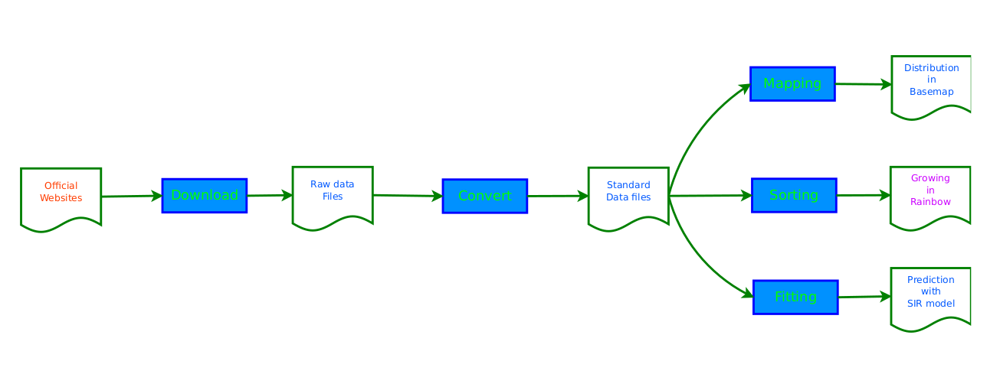
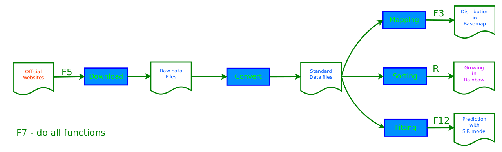

  

# covid19viz
New visualization and prediction of COVID-19 in USA, such as Michigan, CA, OH, NY, TX, showing here at www.appstorego.com.

    I. Visualize the data of COVID-19 today

    II. View the history data of COVID-19

    III. Predict the future of COVID-19

  

# Steps
1. Grab data from goverment websites
2. Save to excel file for store
3. Show data in new diagram

# How to run in Windows
1. Download and install python at https://www.python.org/downloads/ to c:/python3
2. Add path c:/python3 to system path of Windows
3. To install pip, download get-pip.py by following this link: https://bootstrap.pypa.io/get-pip.py. Save to c:/python3
4. Go to c:/python3, run python get-pip.py
5. Add path c:/python3/scripts to system path of Windows
6. Run cmd.exe to enter command window, install libraries by 

     pip3 install opencv-python
     
     pip3 install pandas
     
     pip3 install matplotlib
     
     pip3 install lxml
     
     pip3 install scipy

7. Run python3 coviz.py
8. Optionally install base map
 
     download and install
     
          http://download.osgeo.org/osgeo4w/osgeo4w-setup-x86_64.exe
   
          https://download.microsoft.com/download/7/9/6/796EF2E4-801B-4FC4-AB28-B59FBF6D907B/VCForPython27.msi
     
     pip3 install pyproj==1.9.6
   
     set the system environment variable: 
     
                                        GEOS_DIR=C:\OSGeo4W64
   
                                        PROJ_DIR=C:\OSGeo4W64
                                                         
     add    C:\OSGeo4W64\bin to PATH
   
     pip3 install --user git+https://github.com/matplotlib/basemap.git or 
     pip3 install basemap‑1.2.1‑cp27‑cp27m‑win_amd64.whl (downloaded from https://www.lfd.uci.edu/~gohlke/pythonlibs/)
 9. install chrome driver
 
     https://selenium-python.readthedocs.io/installation.html
     
     In linux: 
     
         sudo cp  ~/Downloads/chromedriver /usr/local/bin/

10. another way to install basemap on ubantu, run these coads in ubantu:

    sudo apt-get install libgeos-3.X.X
    
    sudo apt-get install libgeos-dev
    
    pip3 install --user https://github.com/matplotlib/basemap/archive/master.zip

# How to run in Ubuntu
1. Run python3 coviz.py

# Funcational keys in main window

  

# SIR model
1. Predict with SIR model / SIRmodel, referring to Wuhan data

#
1. to be rooted on ubantu, if you have a password, run 'su'. if there is no password, run 'sudo -i'
2. when using pythn 2, to download pytesseract, you need to run this coad in the terminal: 
    sudo pip3 install pytesseract==0.3.0

